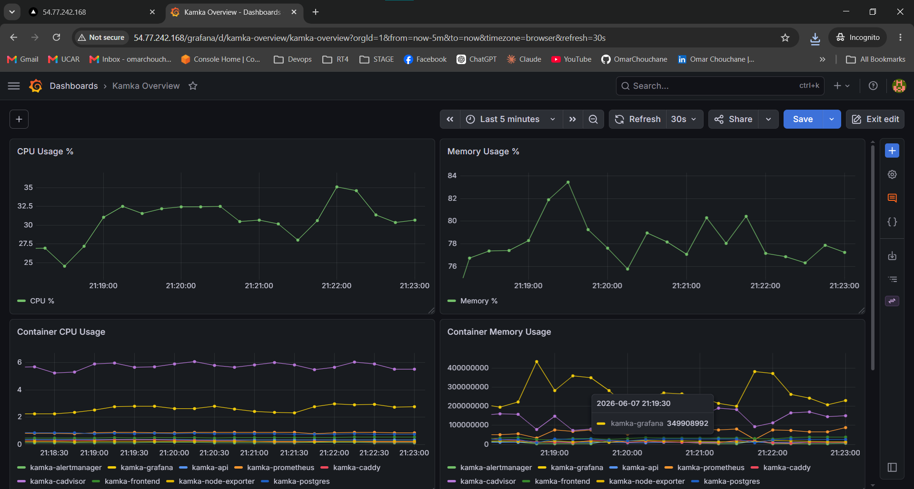
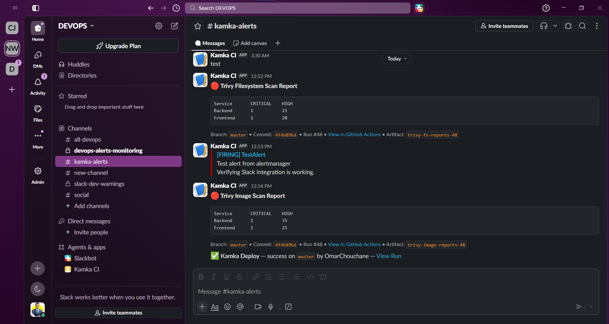
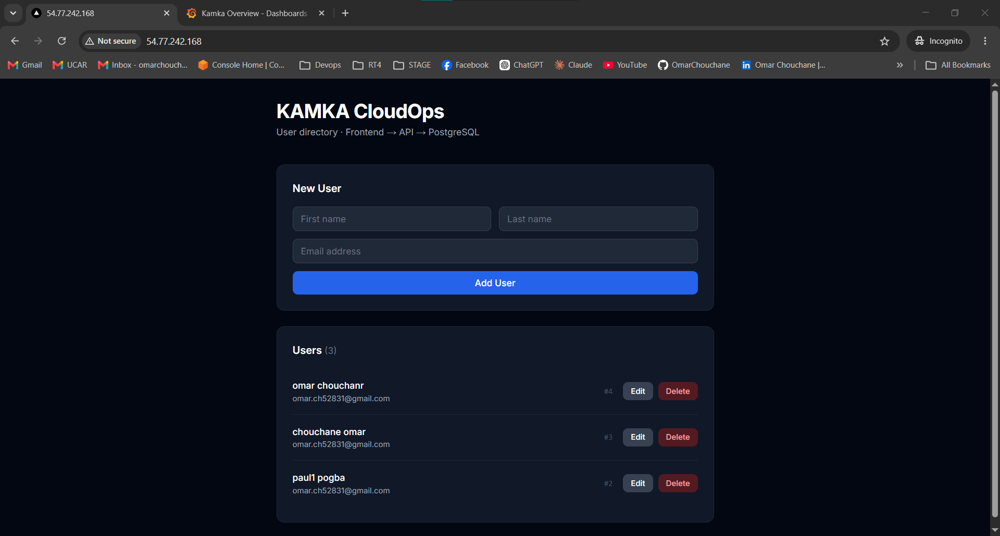

# Kamka CloudOps Platform

A production-grade DevOps platform built on AWS — containerised Node.js + Next.js app, fully automated CI/CD, Infrastructure as Code, and a complete observability stack.

---

## Stack

| Layer | Technology |
|---|---|
| **Application** | Node.js (Express) + Next.js, PostgreSQL 15 |
| **Reverse proxy** | Caddy 2 (automatic HTTPS) |
| **Container runtime** | Docker + Compose |
| **Registry** | GitHub Container Registry (GHCR) |
| **Infrastructure** | AWS EC2 (t3.micro), Terraform |
| **Secrets** | AWS SSM Parameter Store (SecureString) |
| **CI/CD** | GitHub Actions (OIDC — no static keys) |
| **Observability** | Prometheus · Grafana · Alertmanager · cAdvisor · Node Exporter |
| **Security scanning** | Trivy (FS + image) · SonarCloud (SAST) |

---

## Repository Layout

```
├── app/
│   ├── backend/          Node.js API (Express + Sequelize)
│   └── frontend/         Next.js frontend
├── infra/
│   ├── terraform/        VPC, EC2, IAM, SSM — all IaC
│   └── reverse-proxy/    Caddyfile
├── observability/
│   ├── prometheus/       prometheus.yml + alerts.yml (6 rules)
│   ├── alertmanager/     alertmanager.yml (Slack receiver)
│   └── grafana/          provisioned datasource + dashboard
├── deploy/scripts/       bootstrap, deploy, migrate, rollback, backup
├── security/             trivy.yaml, .trivyignore, sonar-project.properties
├── .github/workflows/    ci.yml — 4-job pipeline
└── docker-compose.prod.yml
```

---

## Prerequisites

- AWS account with credentials configured (`aws configure`)
- Terraform ≥ 1.5
- Docker + Docker Compose plugin
- An EC2 key pair created in `eu-west-1`
- A Slack incoming webhook URL

---

## 1 — Provision Infrastructure

```bash
cd infra/terraform

cp env/dev/terraform.tfvars.example terraform.tfvars
# Fill in: ami_id, key_name, db_password, slack_webhook_url, grafana_password

terraform init
terraform apply
```

This creates: VPC, subnet, security group, EC2 instance (with Elastic IP), IAM roles (EC2 + GitHub Actions OIDC), and SSM SecureString parameters.

Note the outputs — you'll need `public_ip` and `github_actions_role_arn`.

---

## 2 — Bootstrap the Server

SSH into the instance and run the bootstrap script once:

```bash
ssh -i ~/.ssh/<key>.pem ubuntu@<public_ip>
curl -fsSL https://raw.githubusercontent.com/OmarChouchane/kamka-cloudops-platform/master/deploy/scripts/bootstrap.sh | bash
```

Then clone the repo:

```bash
sudo mkdir -p /opt/kamka && sudo chown ubuntu:ubuntu /opt/kamka
cd /opt/kamka
git clone https://github.com/OmarChouchane/kamka-cloudops-platform.git .
```

---

## 3 — Configure GitHub Secrets

In your fork's **Settings → Secrets and variables → Actions**, add:

| Secret | Value |
|---|---|
| `AWS_ROLE_ARN` | `github_actions_role_arn` from Terraform output |
| `EC2_HOST` | EC2 public IP |
| `EC2_USER` | `ubuntu` |
| `EC2_SSH_KEY` | Private key content (PEM) |
| `CR_PAT` | GitHub PAT with `write:packages` |
| `GHCR_USERNAME` | Your GitHub username (lowercase) |
| `SLACK_WEBHOOK_URL` | Slack incoming webhook URL |
| `SONAR_TOKEN` | SonarCloud token |

---

## 4 — First Deploy

On the server, fetch secrets and bring the stack up:

```bash
cd /opt/kamka

export POSTGRES_PASSWORD=$(aws ssm get-parameter --name /kamka/POSTGRES_PASSWORD --with-decryption --query Parameter.Value --output text)
export DB_PASSWORD=$POSTGRES_PASSWORD
export SLACK_WEBHOOK_URL=$(aws ssm get-parameter --name /kamka/SLACK_WEBHOOK_URL --with-decryption --query Parameter.Value --output text)
export GRAFANA_PASSWORD=$(aws ssm get-parameter --name /kamka/GRAFANA_PASSWORD --with-decryption --query Parameter.Value --output text)
export REGISTRY=ghcr.io/<your-ghcr-username>
export DOMAIN=<your-ec2-ip>

sed -i "s|\${SLACK_WEBHOOK_URL}|${SLACK_WEBHOOK_URL}|g" observability/alertmanager/alertmanager.yml
docker compose -f docker-compose.prod.yml up -d
```

---

## 5 — CI/CD Pipeline

Every push to `master` (touching `app/` or `.github/workflows/ci.yml`) runs the full pipeline:

```
┌─────────────────┐   ┌──────────────────────┐
│  lint-and-test  │   │   security-scan       │
│  • ESLint       │   │   • SonarCloud SAST   │
│  • Prettier     │   │   • Trivy FS scan     │
│  • Mocha tests  │   │   • Slack report      │
└────────┬────────┘   └──────────┬────────────┘
         └──────────┬────────────┘
                    ▼
         ┌──────────────────────┐
         │   build-and-push     │
         │   • Build images     │
         │   • Trivy image scan │
         │   • Push to GHCR     │
         └──────────┬───────────┘
                    ▼
         ┌──────────────────────┐
         │   deploy             │
         │   • SSH to EC2       │
         │   • Rolling update   │
         │   • DB migrate       │
         │   • Health check     │
         │   • Slack notify     │
         └──────────────────────┘
```

AWS credentials are obtained via **OIDC** — no long-lived keys stored anywhere.

---

## Observability

| Service | Access |
|---|---|
| Grafana | `http://<ip>/grafana` — default user `admin` |
| Prometheus | Internal only (`kamka-prometheus:9090`) |
| Alertmanager | Internal only (`kamka-alertmanager:9093`) |

**Active alert rules:** HighCPU (>85%) · HighMemory (>90%) · ContainerDown · HighErrorRate (>5% 5xx) · DiskSpaceLow (>85%) · BackupMissing (>24h)

All firing alerts route to Slack via Alertmanager.





---

## Application



---

## Useful Commands

```bash
# View all running services
docker compose -f docker-compose.prod.yml ps

# Follow logs for a specific service
docker compose -f docker-compose.prod.yml logs -f api

# Run database migrations manually
bash deploy/scripts/migrate.sh

# Manual backup to S3
S3_BACKUP_BUCKET=<bucket> bash deploy/scripts/backup.sh

# Roll back to a previous image tag
bash deploy/scripts/rollback.sh <git-sha>

# Trigger a test alert to verify Slack integration
docker run --rm --network kamka_kamka_network alpine/curl \
  -X POST http://kamka-alertmanager:9093/api/v2/alerts \
  -H 'Content-Type: application/json' \
  -d '[{"labels":{"alertname":"TestAlert","severity":"warning"},"annotations":{"summary":"Manual test","description":"Slack integration check."},"endsAt":"2099-01-01T00:00:00Z"}]'
```

---

## Security

- No secrets in code or environment files — all fetched from **AWS SSM Parameter Store** at deploy time
- GitHub Actions uses **OIDC** (no static AWS keys)
- Docker images run as **non-root** with read-only filesystems
- Trivy scans on every push (FS + image), results posted to Slack and uploaded as artifacts
- SonarCloud SAST on every push
- EC2 IAM role is least-privilege (SSM read-only + CloudWatch Logs)
